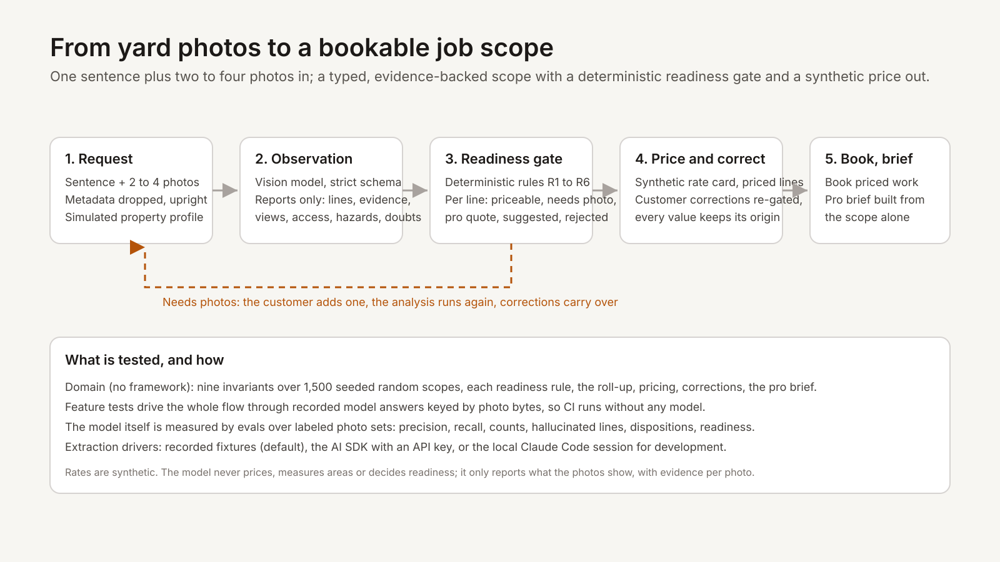
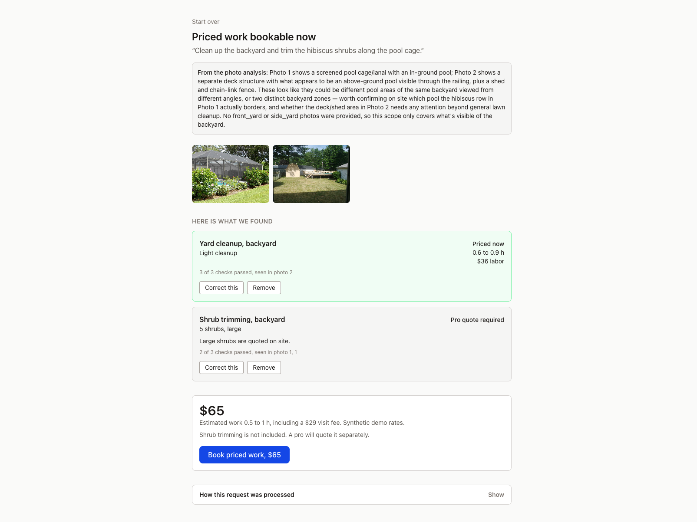
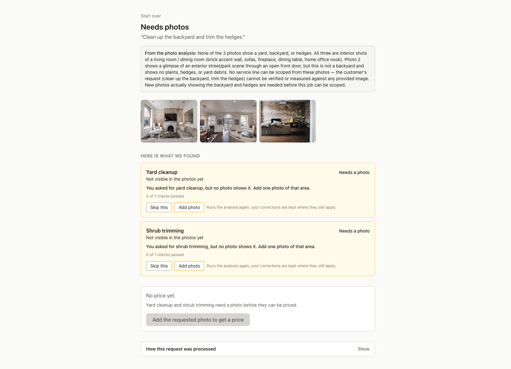

# YardScope

Turn a homeowner's sentence and two to four yard photos into a job a marketplace can price, correct and book, with a pre-visit brief for the pro.

Instant pricing already works for services that can be measured from satellite imagery. YardScope explores the long tail that still needs someone to come and quote it. Not affiliated with any lawn-care or home-services company; rates are synthetic.



## Demo

Both screenshots are live runs through the Claude Code driver on the eval photos.

A partial request: the cleanup is priced now, the shrubs the model rated large go to a pro, and the total is never read as covering them.



The refusal: three living-room photos with a request for a backyard cleanup. The model invents nothing, the pipeline turns the two requested services into placeholders, and the customer is asked for one photo of the area.



## How it decides

1. **Observation.** A vision model reports what the photos show through a strict schema: one line per service and yard section, with the photo and note that support it, which photo it counted from, each photo's view, a possible narrow gate, hazards, and what it could not judge. It never prices, never measures, never decides readiness.
2. **Readiness gate.** Deterministic rules with a fixed precedence decide, per line: `priceable`, `needs_photos` (with the exact photo request), `manual_quote` (large shrubs, large or uncertain branches, hazards), `suggested` (seen but not asked for), or `rejected` (could not be read). Readiness rolls up from the lines: ready, partial, needs photos, or pro quote.
3. **Price and correct.** A synthetic rate card prices the priceable lines only. The customer can remove lines, add suggestions, and correct counts, sizes and severities within bounds; every correction is re-gated by the same rules and stored with the value the customer was looking at and their reason. Adding a photo runs the analysis again and carries the corrections that still apply.
4. **Book and brief.** "Book this job, $165" when everything is priced, "Book priced work, $165" when some lines are gated, with the gated lines named under the price. The pro reads a brief built from the scope alone: every value tagged as seen in the photos or corrected by the customer, evidence per photo, open questions, and three actions.

The worked example (three backyard photos, "clean it up and trim whatever needs trimming") prices a heavy cleanup and four medium shrubs at $165 for 2 to 3.5 hours and sends one large fallen branch to the pro: **partial**. The arithmetic is in the collapsible pipeline panel on every result page. Nine invariants over 1,500 seeded random scopes guard the domain; they are listed in [docs/invariants.md](docs/invariants.md).

## Evals

Twelve labeled photo sets, three live runs on 2026-09-14, every number as the run produced it. The current state (the third run's answers, scored after the labels and the scorer were corrected):

| Metric | Value |
|---|---|
| Schema-valid answers | 12/12 |
| Service precision / recall | 1.000 / 0.933 |
| Counts exact / within one | 0.800 / 1.000 |
| Hallucinated lines | 0 |
| Severity / size correct | 0.889 / 0.750 |
| Dispositions correct | 0.789 |
| Request readiness correct | 9/12 |
| Photo request correct | 0.750 |
| Unusable photos flagged | 1.000 |

Run 1 found the model flagging ordinary overhead power lines as hazards; the instruction was tightened. Between runs, four labels were corrected and the scorer was fixed to stop counting the pipeline's own placeholders as model lines; [docs/evals.md](docs/evals.md) says exactly which gain came from which change, and names every miss. The `/evals` page shows the newest results file; CI replays the recordings and fails on drift.

## What I would measure in production

Quote-to-booking conversion for photo-scoped jobs against manual quotes, and for partial requests specifically; time from request to booked job; how often and by how much pros adjust the scope or price; the needs-photos rate and how often the requested photo unlocks the line; the customer correction rate and its direction (adding work the photos missed, or removing work the model invented); disputes and refunds after the visit; cost and latency per analysis. Corrections from customers and pros would feed the eval set, so the model is judged against what happened on site.

## What it deliberately does not do

No authentication, payments, provider matching, scheduling, maps or notifications. No satellite or address data: the yard size is a simulated property profile in config. No square-footage estimates from photos, which have no reliable scale; the model reports counts, size buckets and severity only. No bounding boxes, no fine-tuning, no claim of conversion uplift, no deployment. Analysis runs inside the request in this prototype; production would queue it.

## How it was built

Laravel 13 on PHP 8.4, Inertia with React 19 and TypeScript, Pest, Larastan at level 7, Pint, SQLite with four tables (requests, observation runs, correction records, pro actions). The scope is never stored: it is rebuilt from the latest observation plus the replayed corrections on every load. `app/Scoping` has no framework dependency, enforced by an architecture test.

Built with Claude Code over two days, every milestone reviewed by a separate reviewer agent against a frozen spec and fixed before merging. The extraction step has three drivers, chosen by `YARDSCOPE_EXTRACTOR`: `fixtures` (recorded answers keyed by photo bytes and sentence; the default, what tests and CI use), `api` (the Laravel AI SDK with `ANTHROPIC_API_KEY`), and `claude-code` (the same instructions and schema through the Claude Code CLI on the developer's own session). The Claude Code driver ran every live eval; the API driver was built against the SDK's fake and was not exercised against a provider, because no key was available. The SDK version used (0.11) has no `AgentFake` despite its docs; the fake is `Ai::fakeAgent()`.

```bash
composer install && npm install
cp .env.example .env && php artisan key:generate && php artisan migrate
npm run build && php artisan serve
```

Checks: `vendor/bin/pint --test`, `vendor/bin/phpstan analyse`, `vendor/bin/pest`, `npm run types:check`, `npm run lint`, `npm run format:check`, `php artisan yardscope:eval --fixtures --expect latest`. Code is MIT licensed; the eval photos keep their own licenses, listed in `evals/LICENSES.md`.
